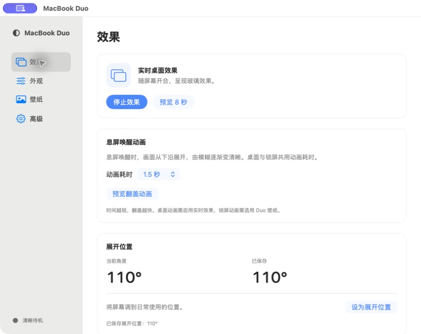
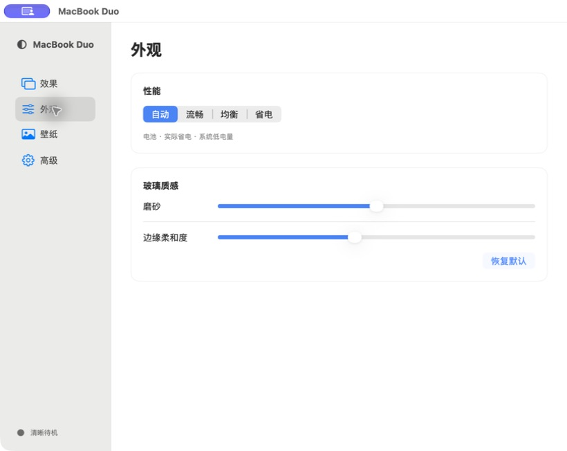
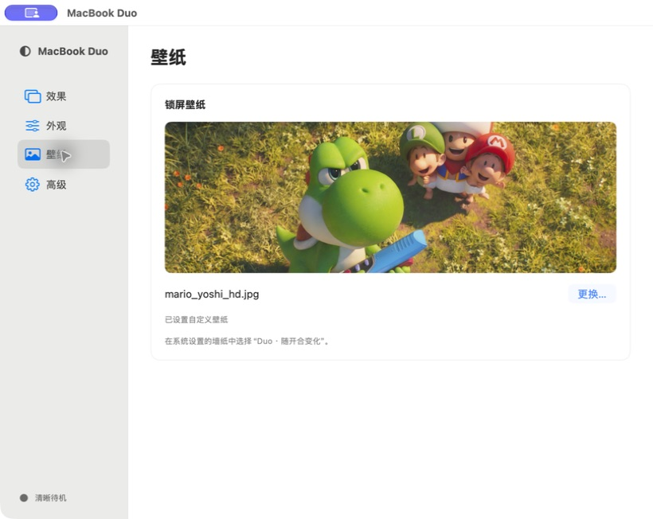

# MacBook Duo

随 MacBook 屏幕开合变化的桌面玻璃效果，支持磨砂、透视、锁屏壁纸和唤醒动画。

## 来源与致谢

**本项目复用了 [kageroumado/phosphene](https://github.com/kageroumado/phosphene) 的部分锁屏壁纸适配代码（MIT 许可）。** 具体范围、原版权及许可见 [第三方声明](THIRD_PARTY_NOTICES.md)。

视觉创意参考b站up主 ** 江灵夏草** 的 [演示](https://www.bilibili.com/video/BV18sYV6uERz/)；投影与铰链读取分别参考 [Duo-animation](https://github.com/Atomicx7/Duo-animation) 和 [LidAngleSensor](https://github.com/samhenrigold/LidAngleSensor)。

## 快速开始

需要 **macOS 26+**、Metal 和兼容的铰链传感器。部分功能使用非公开接口，兼容性因机型和系统版本而异。当前为未公证的开发版。

```sh
xcode-select --install  # 已安装 Command Line Tools 时跳过
./build.sh
open "MacBook Duo.app"
```

首次使用需允许屏幕录制，详见 [权限说明](PERMISSIONS.md)。

## 使用方法

**1. 效果**：启用效果，将屏幕调到舒适角度，点击「设为展开位置」。可调整唤醒动画耗时并预览；截图数值仅为示例。



**2. 外观**：选择性能模式，调整磨砂与边缘柔和度。「自动」会根据电源状态调整。



**3. 壁纸**：点击「更换…」导入图片，再到系统设置 → 墙纸中选择「MacBook Duo · 锁屏壁纸」下的「Duo · 随开合变化（自定义）」。使用时保持主应用运行。



截图壁纸仅作界面示例，不随应用提供，权利归原权利人所有。

快捷键：**⌘⇧G** 启用／停止，**⌘⇧K** 校准，**⌘⇧Esc** 紧急停止。「高级」页可导入截图，单独测试玻璃效果。

## 更多说明

[源码与测试](源码说明.md) · [锁屏扩展](WallpaperPrototype/README.md) · [权限与签名](PERMISSIONS.md)

## 许可证

自有代码采用 [PolyForm Noncommercial 1.0.0](LICENSE)，仅限许可范围内的非商业使用；第三方代码遵循原许可。

Required Notice: Copyright (c) 2026 cjxh21
